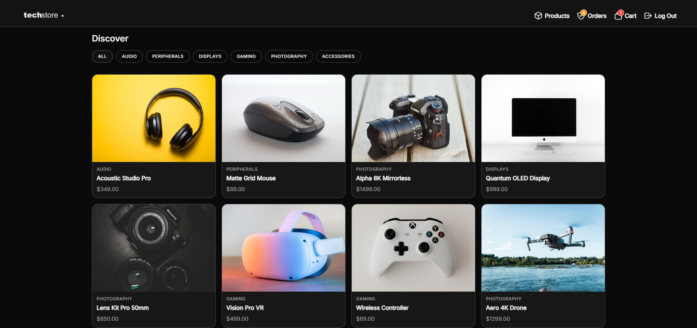

# ⚡️ Premium Mobile E-Commerce Engine


<div align="center">
  
</div>
<br />

A high-performance, full-stack, cross-platform e-commerce application. It allows users to browse premium hardware, manage a persistent shopping cart, securely authenticate, and complete transactions. It features a dedicated Admin Dashboard for real-time order fulfillment, complete inventory management, and automated stock deductions, backed by a robust PostgreSQL database.

## 🚀 Live Deployments

- 🌐 **Frontend (Vercel):** [https://mobile-ecommerce-engine-nygp.vercel.app](https://mobile-ecommerce-engine-nygp.vercel.app)
- ⚙️ **Backend (Supabase):** BaaS handling Authentication, PostgreSQL, and Row Level Security.

### 🔑 Live Demo Admin Access
To test the admin dashboard, inventory controls, and order management features on the live deployment, please log in with the following credentials:
- **Email:** `admin@admin.com`
- **Password:** `admin`

## ✨ Features Achieved

- **Comprehensive Inventory CMS:** Dedicated admin dashboard for full CRUD (Create, Read, Update, Delete) product management. Features interactive steppers for manual stock adjustments with immediate optimistic UI rendering.
- **Smart Stock & Automated Fulfillment:** Products dynamically hide from the public storefront when stock reaches zero. Successful checkouts trigger automatic, secure backend transactions to deduct purchased quantities from active inventory.
- **Global Authentication & Security:** Secure email/password login via Supabase Auth, featuring persistent sessions, seamless route guarding, and UI state synchronization.
- **Real-Time Cart & Checkout:** Dynamic global state management using React Context for instant cart updates, quantity controls, stock validation, and accurate total calculations.
- **Admin Operations Dashboard:** Role-based access control allows users with `is_admin` privileges to view live orders, drill down into purchased item details, toggle fulfillment statuses (Pending/Shipped), and securely delete records.
- **Premium UI:** Features dynamic System Dark/Light Mode, native haptic feedback (`expo-haptics v56.0.3`), frosted glass navigation bars (`expo-blur v56.0.3`), and conditional notification badging.
- **Fluid Cross-Platform Navigation:** Built with React Navigation (`v7.2.5`) and custom web-linking configurations, ensuring perfect synchronization with the browser's URL history and back-button routing on the web.

## ⚙️ Runtimes, Engines, and Tools

To run this project locally, the following environment is required. *(Note: These are the exact versions used during development and testing).*

### Runtimes & Package Managers
- **Node.js:** `v24.14.0`
- **npm:** `11.16.0`
- **OS**: Windows, macOS, or Linux

### Core Dependencies & Engines
- **Frontend (Mobile/Web):** React (`v19.2.3`), React Native (`v0.85.3`), Expo (`v56.0.9`)
- **Backend/Database:** Supabase JS Client (`v2.108.0`), PostgreSQL
- **Navigation:** React Navigation Native (`v7.2.5`), Native Stack

## 🚀 How to Run Locally

### 1. Clone the repository
```bash
git clone [https://github.com/notrexxx/mobile-ecommerce-engine.git](https://github.com/notrexxx/mobile-ecommerce-engine.git)
cd mobile-ecommerce-engine
```

### 2. Install Dependencies
```bash
cd mobile
npm install
```

### 3. Environment Variables
Create a `.env` file in the `/mobile` directory with the following exact format (no spaces around the equals sign, no quotes):

```text
EXPO_PUBLIC_SUPABASE_URL=your_supabase_project_url
EXPO_PUBLIC_SUPABASE_ANON_KEY=your_supabase_anon_key
```

### 4. Start the Application
```bash
npx expo start -c
```
*(Press 'w' to open in the web browser, 'i' for iOS simulator, or 'a' for Android emulator).*

## 🗄️ Database Schema

The backend utilizes three core tables protected by strict Row Level Security (RLS) policies to ensure data integrity and access control.

* `profiles`: Manages user identities, secure emails, and admin privileges (`is_admin` boolean).
* `products`: Stores inventory data, categorizations, pricing, image references, and tracks active warehouse stock quantities.
* `orders`: Stores secure transaction data, JSONB cart arrays, pricing totals, and live fulfillment status (`pending` / `shipped`). Connected via Foreign Key constraints.

## Author

👤 **Andres Leon**

- GitHub: [@notrexxx](https://github.com/notrexxx)
- LinkedIn: [Emigdio Leon](https://linkedin.com/emigdio-leon-689109195)